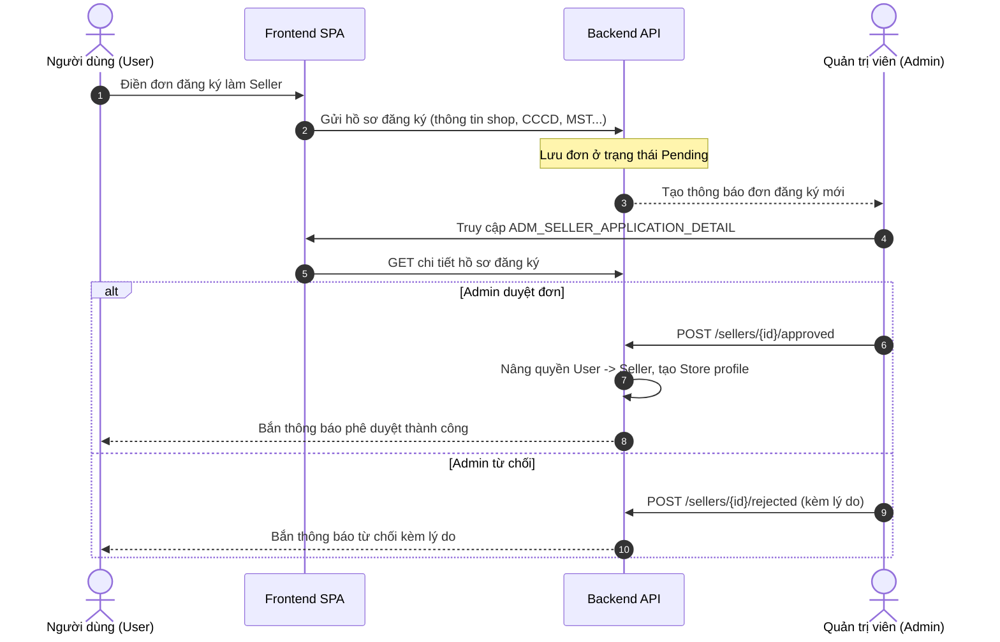
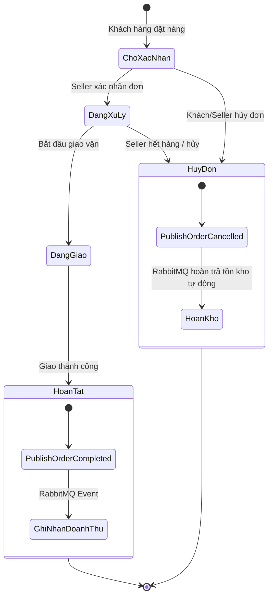

# Tài Liệu Tổng Quan Hệ Thống (System Requirements & Overview)

> **Tên dự án**: AuraMart (Shoppy) - E-Commerce Web Application  
> **Mô hình**: Sàn thương mại điện tử đa người bán (Multi-Vendor Marketplace)  
> **Phiên bản tài liệu**: 2.0 (Cập nhật đồng bộ theo Backend .NET Web API & Frontend Angular 21)

---

## 1. 🎯 Tổng Quan & Mục Tiêu Dự Án

### 1.1. Giới thiệu
**AuraMart (Shoppy)** là nền tảng thương mại điện tử (Multi-vendor Marketplace) hoàn chỉnh kết nối 3 đối tượng người dùng chính: **Admin (Quản trị sàn) – Seller (Nhà bán hàng) – Người mua (Buyer / Khách hàng)**.

Hệ thống được thiết kế theo hướng kiến trúc phân tầng chuyên nghiệp (**Clean Architecture** & chuyển dịch sang **Microservices**), đảm bảo tính module hóa cao, khả năng mở rộng linh hoạt (scalability), tính sẵn sàng và khả năng xử lý nghiệp vụ phức tạp của thương mại điện tử quy mô lớn.

### 1.2. Mục tiêu bài toán
- **Đối với Quản trị viên (Admin)**: Cung cấp bảng điều khiển trung tâm để giám sát toàn bộ hoạt động của sàn, kiểm duyệt chất lượng hồ sơ nhà bán hàng, quản lý cây danh mục sản phẩm, quản lý tài khoản người dùng và bảo đảm an toàn hệ sinh thái.
- **Đối với Nhà bán hàng (Seller)**: Cung cấp giải pháp vận hành kinh doanh khép kín (end-to-end), từ đăng ký cửa hàng, quản lý danh mục sản phẩm, upload media, giám sát hàng tồn kho với cảnh báo tự động, tiếp nhận và xử lý đơn hàng, đến phân tích báo cáo doanh thu trực quan.
- **Đối với Người mua (Buyer) & Khách vãng lai (Guest)**: Cung cấp trải nghiệm mua sắm mượt mà, duyệt xem sản phẩm công khai, tìm kiếm theo danh mục, xác thực an toàn (hỗ trợ cả đăng nhập truyền thống lẫn mạng xã hội OAuth).

---

## 2. 👥 Các Đối Tượng Người Dùng & Vai Trò (User Roles)

| Vai trò | Định danh Role | Mô tả & Trách nhiệm chính |
|---|---|---|
| **Khách vãng lai** | `Guest` | Người dùng chưa đăng nhập; được phép duyệt xem trang chủ, danh mục, sản phẩm công khai, đăng ký tài khoản hoặc nộp đơn trở thành người bán. |
| **Người mua** | `User` | Khách hàng đã xác thực; quản lý thông tin cá nhân, nhận thông báo toàn cục, thực hiện các tương tác mua sắm. |
| **Nhà bán hàng** | `Seller` | Đối tác kinh doanh đã được Admin phê duyệt hồ sơ; có toàn quyền quản trị gian hàng, danh mục sản phẩm riêng, tồn kho, đơn hàng của shop và xem báo cáo tài chính. |
| **Quản trị viên** | `Admin` | Quản trị viên tối cao của sàn; phê duyệt/từ chối đơn đăng ký seller, quản lý cây danh mục hệ thống, quản lý tài khoản người dùng và xem thống kê vĩ mô toàn sàn. |

---

## 3. 🏗️ Kiến Trúc Kỹ Thuật & Công Nghệ (Technology Stack)

### 3.1. Phân tầng công nghệ

```
┌─────────────────────────────────────────────────────────────────────────┐
│                        FRONTEND LAYER (Angular 21)                      │
│     4 Areas: publish (/), auth (/auth), admin (/admin), seller (/seller)│
│     Bootstrap 5.3  •  TypeScript  •  RxJS  •  Chart.js  •  @ngx-translate│
└────────────────────────────────────┬────────────────────────────────────┘
                                     │ HTTPS / RESTful API (HttpOnly Cookie)
                                     ▼
┌─────────────────────────────────────────────────────────────────────────┐
│                        BACKEND LAYER (.NET Web API)                     │
│    Clean Architecture (Domain, Application, Infrastructure, API/Module) │
│    Modules: Identity, Catalog, Ordering, Seller, Notification, Cart, Pay│
└──────────────┬─────────────────────┬─────────────────────┬──────────────┘
               │                     │                     │
               ▼                     ▼                     ▼
┌───────────────────────┐ ┌────────────────────┐ ┌────────────────────────┐
│  DATABASE (PostgreSQL)│ │ CACHE (Redis 7)    │ │ MESSAGE BROKER (Rabbit)│
│  Isolated Databases   │ │ Session, Caching,  │ │ Async Events, Saga,    │
│  EF Core Migrations   │ │ Temporary Keys     │ │ Order Complete/Cancel  │
└───────────────────────┘ └────────────────────┘ └────────────────────────┘
```

- **Frontend (`web_banhang_fe`)**:
  - **Framework**: Angular 21 (Standalone Components, modern control flow `@if`, `@for`).
  - **Giao diện**: Bootstrap 5.3, Bootstrap Icons, responsive đa màn hình.
  - **Biểu đồ & Tiện ích**: Chart.js cho dashboard thống kê, `@ngx-translate` cho đa ngôn ngữ.
  - **Phân chia Route (4 Areas)**:
    - `publishRoutes` (`/`): Storefront công khai.
    - `authRoutes` (`/auth/*`): Layout xác thực độc lập.
    - `adminRoutes` (`/admin/*`): Layout quản trị với `roleGuard(['Admin'])`.
    - `sellerRoutes` (`/seller/*`): Layout kênh người bán với `roleGuard(['Seller'])`.
- **Backend (`web_banhang_be`)**:
  - **Framework**: C# / .NET Web API theo nguyên tắc Clean Architecture.
  - **Cơ chế lưu trữ**: PostgreSQL 16 (tách biệt dữ liệu theo module/service).
  - **Caching & Key-Value**: Redis 7 Alpine (bộ đệm dữ liệu, session state, tạm khóa OTP/OAuth key).
  - **Truyền thông tin bất đồng bộ**: RabbitMQ 3 (Event-driven, Saga pattern, Integration Events).
  - **Lưu trữ tệp đa phương tiện**: Supabase Storage (lưu trữ và phân phối hình ảnh sản phẩm).
  - **Bảo mật**: JWT Tokens (Access & Refresh Token) lưu trữ an toàn trong **HttpOnly Cookie** chống tấn công XSS.

---

## 4. 📦 Chi Tiết Các Phân Hệ Chức Năng (Functional Modules)

### 4.1. Phân hệ Xác thực & Định danh (Identity & Auth)
- **Mã route FE**: `/auth/*` (Màn hình: `AUTH_SIGNIN`, `AUTH_SIGNUP`, `AUTH_ACCESS_DENIED`).
- **Nhóm API BE**: `/api/v1/auth/*` (8 APIs: `AUTH_SIGNIN` đến `AUTH_FINALIZE_LOGIN`).
- **Chức năng chi tiết**:
  1. **Đăng ký tài khoản (`AUTH_SIGNUP`)**: Tạo tài khoản người dùng mới với thông tin họ tên, email, mật khẩu.
  2. **Đăng nhập truyền thống (`AUTH_SIGNIN`)**: Xác thực tài khoản email/mật khẩu, cấp phát cặp token `accessToken` và `refreshToken` thông qua HttpOnly Cookie an toàn.
  3. **Đăng nhập mạng xã hội (OAuth 2.0 - Google & Facebook)**:
     - Gọi `AUTH_EXTERNAL_LOGIN` chuyển hướng đến nhà cung cấp danh tính.
     - Sau khi ủy quyền, chuyển về `AUTH_EXTERNAL_LOGIN_CALLBACK`.
     - Sinh mã định danh tạm thời lưu vào Redis và hoàn tất thông qua `AUTH_FINALIZE_LOGIN`.
  4. **Làm mới phiên làm việc (`AUTH_REFRESH_TOKEN`)**: Tự động cấp mới Access Token khi token cũ hết hạn mà không làm gián đoạn trải nghiệm người dùng.
  5. **Thông tin cá nhân & Đăng xuất (`AUTH_ME`, `AUTH_LOGOUT`)**: Truy xuất profile người dùng hiện tại và xóa phiên đăng nhập trên trình duyệt.

---

### 4.2. Phân hệ Quản trị Hệ thống (Admin Portal)
- **Mã route FE**: `/admin/*` (Màn hình: `ADM_DASHBOARD`, `ADM_SELLER_*`, `ADM_USER_*`, `ADM_CATEGORY_*`).
- **Nhóm API BE**: `/api/v1/admin/*` (15 APIs: `ADMIN_DASHBOARD_STATS` đến `ADMIN_SELLER_APPLICATION_DETAIL`).
- **Chức năng chi tiết**:
  1. **Bảng điều khiển Quản trị (`ADM_DASHBOARD`)**:
     - Thống kê các chỉ số vĩ mô toàn sàn: Tổng số người dùng, tổng số seller, doanh thu sàn, số lượng đơn hàng phát sinh.
     - Biểu đồ tăng trưởng trực quan (`ADMIN_DASHBOARD_CHART`) theo khoảng thời gian linh hoạt (ngày, tháng, năm).
  2. **Quản lý Tài khoản Người dùng (`ADM_USER_LIST`, `ADM_USER_DETAIL`)**:
     - Xem danh sách người dùng phân trang, hỗ trợ tìm kiếm và lọc theo trạng thái.
     - Xem chi tiết hồ sơ tài khoản, lịch sử hoạt động.
     - Khởi tạo tài khoản người dùng hoặc cấp quyền quản trị viên (`ADMIN_USER_CREATE`).
  3. **Quản lý & Duyệt Hồ sơ Người bán (`ADM_SELLER_LIST`, `ADM_SELLER_DETAIL`, `ADM_SELLER_APPLICATION_DETAIL`)**:
     - Tiếp nhận và quản lý danh sách đơn xin mở gian hàng bán hàng từ phía người dùng.
     - Xem xét chi tiết hồ sơ đăng ký kinh doanh: thông tin pháp lý, số điện thoại, địa chỉ, giấy phép.
     - Phê duyệt đơn đăng ký (`ADMIN_SELLER_APPLICATION_APPROVE`): Tự động thăng cấp role cho người dùng thành `Seller` và tạo hồ sơ cửa hàng.
     - Từ chối đơn đăng ký (`ADMIN_SELLER_APPLICATION_REJECT`): Kèm theo lý do từ chối gửi thông báo cho người nộp đơn.
  4. **Quản lý Cây Danh mục Sản phẩm (`ADM_CATEGORY_*`)**:
     - Quản lý danh mục theo cấu trúc phân cấp dạng cây (Category Tree: danh mục cha, danh mục con).
     - Đầy đủ thao tác: Thêm mới (`ADMIN_CATEGORY_CREATE`), Cập nhật thông tin (`ADMIN_CATEGORY_UPDATE`), Xóa danh mục (`ADMIN_CATEGORY_DELETE`).

---

### 4.3. Phân hệ Kênh Nhà Bán Hàng (Seller Portal)
- **Mã route FE**: `/seller/*` (Màn hình: `SEL_DASHBOARD`, `SEL_PRODUCTS`,...).
- **Nhóm API BE**: `/api/v1/rseller/*` (25 APIs: `SELLER_PRODUCT_*`, `SELLER_INVENTORY_*`, `SELLER_ORDER_*`, `SELLER_REVENUE_*`, `SELLER_SETTING_*`).
- **Chức năng chi tiết**:
  1. **Bảng điều khiển Người bán (`SEL_DASHBOARD`)**:
     - Thống kê tổng số đơn hàng cần xử lý, tổng doanh số tạm tính, tỷ lệ hoàn tất đơn.
     - Biểu đồ phân tích doanh thu theo ngày/tuần/tháng (`SELLER_DASHBOARD_CHART`).
  2. **Quản lý Sản phẩm & Hình ảnh (`SELLER_PRODUCT_*`)**:
     - Danh sách sản phẩm của cửa hàng kèm phân trang, tìm kiếm theo tên, phân loại theo danh mục.
     - Thêm mới sản phẩm (`SELLER_PRODUCT_CREATE`) và chỉnh sửa thông tin chi tiết (`SELLER_PRODUCT_UPDATE`).
     - Bật/tắt trạng thái kinh doanh của sản phẩm (`SELLER_PRODUCT_CHANGE_STATUS` - Active/Inactive).
     - Quản lý hình ảnh đa phương tiện: Tải ảnh trực tiếp lên **Supabase Storage** (`SELLER_PRODUCT_IMAGE_UPLOAD`), gán ảnh vào sản phẩm, thiết lập ảnh đại diện chính (`SELLER_PRODUCT_IMAGE_SET_MAIN`), cập nhật hoặc xóa ảnh.
  3. **Quản lý Kho hàng & Tồn kho (`SELLER_INVENTORY_*`)**:
     - Theo dõi số lượng tồn kho thực tế của từng mã sản phẩm (`SELLER_INVENTORY_LIST`).
     - Cập nhật tăng/giảm lượng hàng tồn (`SELLER_INVENTORY_UPDATE`).
     - Tự động đánh dấu cờ cảnh báo: Sắp hết hàng (`isLowStock` khi số lượng dưới ngưỡng quy định) và Hết hàng (`isOutOfStock` khi số lượng bằng 0) để người bán kịp thời nhập hàng.
  4. **Quản lý & Xử lý Đơn hàng (`SELLER_ORDER_*`)**:
     - Xem danh sách đơn hàng đặt từ gian hàng của mình kèm trạng thái (Chờ xác nhận, Đang chuẩn bị, Đang giao, Đã giao, Đã hủy).
     - Xem chi tiết từng đơn: địa chỉ giao hàng, danh sách sản phẩm, số lượng, giá tiền.
     - Cập nhật tiến độ trạng thái đơn hàng (`SELLER_ORDER_UPDATE_STATUS`).
     - **Hoàn tất đơn hàng (`SELLER_ORDER_COMPLETE`)**: Xác nhận giao dịch thành công, phát hành sự kiện tích hợp `OrderCompletedIntegrationEvent` để ghi nhận doanh thu vào hệ thống.
     - **Hủy đơn hàng (`SELLER_ORDER_CANCEL`)**: Hủy đơn khi có sự cố, phát hành sự kiện tích hợp `OrderCancelledIntegrationEvent` để tự động hoàn trả số lượng hàng về kho (Rollback Inventory).
  5. **Báo cáo Tài chính & Phân tích Doanh thu (`SELLER_REVENUE_*`)**:
     - Báo cáo tổng hợp doanh thu thuần, tiền thu về (`SELLER_REVENUE_SUMMARY`).
     - Biểu đồ tăng trưởng doanh số theo chu kỳ (`SELLER_REVENUE_CHART`).
     - Thống kê danh sách các mặt hàng bán chạy nhất của cửa hàng (`SELLER_REVENUE_TOP_SELLING`).
  6. **Cài đặt Gian hàng (`SELLER_SETTING_*`)**:
     - Quản lý và cập nhật thông tin cửa hàng: tên gian hàng, logo/banner, địa chỉ xuất kho, hotline liên hệ, chính sách đổi trả.

---

### 4.4. Phân hệ Thông Báo Toàn Cục (Global Notifications)
- **Nhóm API BE**: `/api/v1/global/notifications/*` (3 APIs: `NOTI_GET_MY_NOTIFICATIONS`, `NOTI_GET_UNREAD_COUNT`, `NOTI_MARK_AS_READ`).
- **Chức năng chi tiết**:
  - Dùng chung cho toàn bộ người dùng đã xác thực (Admin, Seller, User).
  - Hiển thị danh sách thông báo phân trang theo thời gian thực (đơn hàng mới, trạng thái duyệt đơn đăng ký, cảnh báo tồn kho, thông báo hệ thống).
  - Badge hiển thị số lượng thông báo chưa đọc (`unread-count`).
  - Đánh dấu đã đọc (`read`) cho từng thông báo hoặc toàn bộ danh sách.

---

### 4.5. Phân hệ Khách Hàng & Storefront Công Khai (Public Storefront)
- **Mã route FE**: `/` (Màn hình: `PUB_HOME`).
- **Chức năng chi tiết**:
  - Trang chủ giới thiệu sản phẩm và thương hiệu của sàn.
  - Banner quảng bá, danh sách danh mục nổi bật, sản phẩm mới nhất, sản phẩm giảm giá/bán chạy.
  - Hỗ trợ xem sản phẩm mà không bắt buộc người xem phải đăng nhập tài khoản trước.

---

### 4.6. Các Phân Hệ Đang Phát Triển (In-Progress & Roadmap)
- **Module Giỏ Hàng (`Cart`)**:
  - Đã có cấu trúc Domain, Entity và logic giỏ hàng lưu trữ session/database.
  - Đang hoàn thiện các Controller/API: Thêm vào giỏ, cập nhật số lượng, xóa mục, đồng bộ giỏ hàng giữa khách vãng lai và tài khoản đã đăng nhập.
- **Module Thanh Toán (`Payment`)**:
  - Đã xây dựng mô hình dữ liệu giao dịch và nhật ký thanh toán.
  - Đang phát triển tích hợp cổng thanh toán trực tuyến (VNPAY, MoMo, thẻ nội địa/quốc tế) cùng cơ chế xử lý Webhook / IPN bảo mật.

---

## 5. 🛡️ Ma Trận Phân Quyền (RBAC Matrix)

| Nhóm chức năng | Guest | User | Seller | Admin |
|---|:---:|:---:|:---:|:---:|
| **Xem Storefront & Sản phẩm công khai** | ✅ | ✅ | ✅ | ✅ |
| **Đăng ký / Đăng nhập / OAuth** | ✅ | ✅ | ✅ | ✅ |
| **Nộp đơn đăng ký làm Seller** | ❌ | ✅ | ❌ *(Đã là Seller)* | ❌ |
| **Nhận thông báo cá nhân (Notification)** | ❌ | ✅ | ✅ | ✅ |
| **Quản trị Dashboard Admin** | ❌ | ❌ | ❌ | ✅ |
| **Duyệt / Từ chối đơn đăng ký Seller** | ❌ | ❌ | ❌ | ✅ |
| **Quản lý Cây danh mục sản phẩm sàn** | ❌ | ❌ | ❌ | ✅ |
| **Quản lý danh sách Người dùng toàn sàn** | ❌ | ❌ | ❌ | ✅ |
| **Quản trị Dashboard Seller** | ❌ | ❌ | ✅ | ❌ |
| **Quản lý Sản phẩm / Hình ảnh riêng của Shop** | ❌ | ❌ | ✅ | ❌ |
| **Quản lý Kho & Nhận cảnh báo Tồn kho** | ❌ | ❌ | ✅ | ❌ |
| **Tiếp nhận, Xử lý, Hoàn tất & Hủy Đơn hàng** | ❌ | ❌ | ✅ | ❌ |
| **Xem Báo cáo Doanh thu & Top Sản phẩm của Shop**| ❌ | ❌ | ✅ | ❌ |
| **Cấu hình thông tin Gian hàng (Shop Settings)** | ❌ | ❌ | ✅ | ❌ |

---

## 6. 🔄 Các Luồng Nghiệp Vụ & Xử Lý Sự Kiện Cốt Lõi (Core Workflows)

### 6.1. Luồng Onboarding & Phê Duyệt Nhà Bán Hàng


### 6.2. Luồng Quản Lý Tồn Kho & Cảnh Báo
- Khi Seller cập nhật sản phẩm hoặc kho hàng:
  - Nếu `StockQuantity <= Threshold` $\rightarrow$ Tự động bật cờ `isLowStock = true`.
  - Nếu `StockQuantity == 0` $\rightarrow$ Tự động bật cờ `isOutOfStock = true`.
- Hệ thống gửi cảnh báo thời gian thực lên Dashboard Seller để nhắc nhở nhập hàng.

### 6.3. Luồng Xử Lý Đơn Hàng & Kiến Trúc Hướng Sự Kiện (Event-Driven Saga)


- **Khi hoàn tất đơn (`Order Completed`)**:
  - Seller kích hoạt hoàn tất đơn $\rightarrow$ Hệ thống cập nhật trạng thái đơn thành công $\rightarrow$ Phát hành `OrderCompletedIntegrationEvent` qua RabbitMQ $\rightarrow$ Service Doanh thu tiếp nhận và cập nhật vào báo cáo tài chính của Seller.
- **Khi hủy đơn (`Order Cancelled`)**:
  - Hủy đơn $\rightarrow$ Phát hành `OrderCancelledIntegrationEvent` qua RabbitMQ $\rightarrow$ Service Kho hàng tự động hoàn trả số lượng các mặt hàng trong đơn về lại kho (tự động cộng tồn kho, xóa cờ `isOutOfStock` nếu tồn > 0).

### 6.4. Luồng Đăng Nhập An Toàn OAuth 2.0 (Google / Facebook)
1. User click "Đăng nhập với Google / Facebook" tại màn hình `AUTH_SIGNIN`.
2. Hệ thống gọi `/api/v1/auth/external-login?provider={provider}`.
3. Người dùng ủy quyền trên giao diện nhà cung cấp OAuth.
4. Provider chuyển hướng về callback của hệ thống `/api/v1/auth/external-login-callback`.
5. Backend xác thực thông tin tài khoản, tạo mã truy cập tạm thời (Temporary Key) lưu vào Redis với TTL ngắn hạn (vài phút).
6. Frontend tiếp nhận mã tạm thời và gọi `/api/v1/auth/finalize-login?key={key}`.
7. Backend kiểm tra mã hợp lệ, sinh cặp JWT `accessToken` & `refreshToken` rồi đính kèm vào **HttpOnly Secure Cookie** trả về cho trình duyệt.

---

## 7. 📑 Bản Đồ & Liên Kết Tài Liệu Kỹ Thuật

Tài liệu này được liên kết chặt chẽ với các tài liệu kỹ thuật chi tiết khác trong dự án:

| Tài liệu | Đường dẫn | Nội dung chi tiết |
|---|---|---|
| **Danh sách API** | [Api_list.md](file:///d:/VSC/WEB/AuraCard/Documents/api/Api_list.md) | Danh mục đầy đủ 51 RESTful API endpoints phân theo từng module và role. |
| **Đặc tả Chi tiết API** | [Api_Detail.md](file:///d:/VSC/WEB/AuraCard/Documents/api/Api_Detail.md) | Chi tiết Request Body, Query Params, Response DTO, Mã lỗi HTTP status. |
| **Danh sách Màn hình** | [Screen_List.md](file:///d:/VSC/WEB/AuraCard/Documents/screens/Screen_List.md) | Danh mục 16 màn hình Angular SPA, định danh Screen ID và cấu trúc Route. |
| **Kiến trúc & Hướng dẫn** | [README.md](file:///d:/VSC/WEB/AuraCard/README.md) & [README_VI.md](file:///d:/VSC/WEB/AuraCard/README_VI.md) | Sơ đồ hệ thống, hướng dẫn triển khai Docker Compose, môi trường dev và prod. |
| **Giấy phép Bản quyền** | [LICENSE](file:///d:/VSC/WEB/AuraCard/LICENSE) | Giấy phép mã nguồn mở GNU General Public License v3.0 (GPL-3.0). |

---

*Tài liệu được chuẩn hóa phục vụ công tác phát triển, kiểm thử (QA/QC), tích hợp hệ thống và chuyển giao dự án.*
