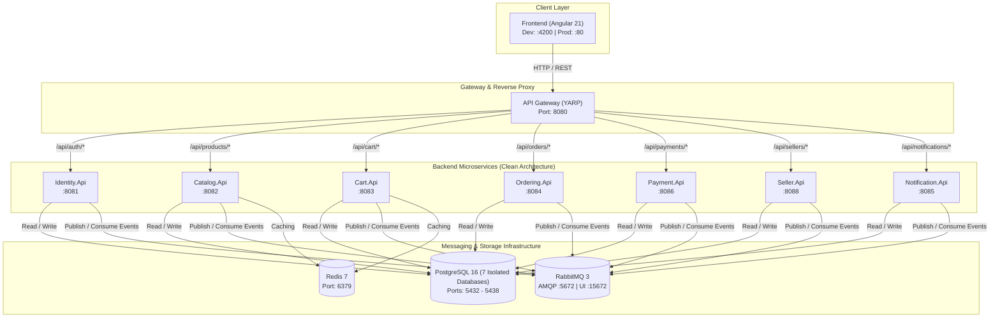

# AuraMart - E-Commerce Web Application


[Tiếng Việt](README_VI.md) | [English](README.md)

A full-stack e-commerce platform built with **microservices architecture** and **clean architecture** principles. AuraMart supports multi-vendor marketplace, product catalog, shopping cart, orders, payments, and seller management.

## 🎯 Project Overview

### Problem Statement & Goal
Build a scalable, production-ready e-commerce platform using microservices architecture and clean code principles. The platform supports multiple sellers, product catalog management, shopping cart, orders, payments, and seller management.

### Key Features
- ✅ Multi-seller product marketplace
- ✅ Product catalog with categories and reviews
- ✅ Shopping cart & order management
- ✅ Payment processing integration
- ✅ Seller management & inventory tracking
- ✅ Real-time notifications
- ✅ JWT-based authentication & authorization
- ✅ Responsive Angular frontend with Bootstrap UI

## 🏗️ Technology Stack

| Layer | Technology |
|-------|-----------|
| **Frontend** | Angular 21, TypeScript, Bootstrap 5.3, Chart.js, @ngx-translate |
| **API Gateway** | YARP (Yet Another Reverse Proxy) - .NET based |
| **Microservices** | C# (.NET 8+), Clean Architecture |
| **Databases** | PostgreSQL 16 (per-service databases) |
| **Caching & Messaging** | Redis 7, RabbitMQ 3 |
| **Containerization** | Docker & Docker Compose |

## 🔗 System Architecture

### High-Level Overview
AuraMart follows a **microservices architecture** pattern:
- **Frontend (Angular)** communicates through a centralized **YARP API Gateway**
- Gateway routes requests to **7 independent microservices**
- Each microservice has its own **PostgreSQL database** (database per service pattern)
- **Redis** for caching and session management
- **RabbitMQ** for asynchronous event-driven communication
- All services use **clean architecture** with layered design

### Architecture Diagram



```text
┌───────────────────────────────────────────────────────────────────────────────────────┐
│                         CLIENT / FRONTEND APPLICATION                                 │
│                  Angular 21  •  Ports: 4200 (Dev) / 80 (Prod)                         │
└────────────────────────────────────────┬──────────────────────────────────────────────┘
                                         │ HTTP / HTTPS (REST API)
                                         ▼
┌───────────────────────────────────────────────────────────────────────────────────────┐
│                             YARP API GATEWAY                                          │
│               Reverse Proxy • Central Routing • CORS • Port: 8080                     │
└───┬────────────┬────────────┬────────────┬────────────┬────────────┬──────────────────┘
    │            │            │            │            │            │             │
    ▼            ▼            ▼            ▼            ▼            ▼             ▼
┌─────────┐  ┌─────────┐  ┌─────────┐  ┌─────────┐  ┌─────────┐  ┌─────────┐  ┌─────────┐
│Identity │  │ Catalog │  │  Cart   │  │Ordering │  │ Payment │  │ Seller  │  │Notificat│
│  :8081  │  │  :8082  │  │  :8083  │  │  :8084  │  │  :8086  │  │  :8088  │  │  :8085  │
└────┬────┘  └────┬────┘  └────┬────┘  └────┬────┘  └────┬────┘  └────┬────┘  └────┬────┘
     │            │            │            │            │            │            │
     ├────────────┴────────────┴────────────┼────────────┴────────────┴────────────┤
     │                                      │                                      │
     ▼                                      ▼                                      ▼
┌─────────────────────────┐    ┌─────────────────────────┐    ┌─────────────────────────┐
│  RabbitMQ 3 (AMQP/Bus)  │    │  Redis 7 (Distributed)  │    │  PostgreSQL (7 DBs)     │
│   :5672 (UI: 15672)     │    │       Port: 6379        │    │    Ports: 5432 - 5438   │
└─────────────────────────┘    └─────────────────────────┘    └─────────────────────────┘
```

## 🚀 Microservices

Each service follows **Clean Architecture** with layers:
- **Domain Layer** - Core business logic, entities, repositories
- **Application Layer** - Use cases, DTOs, business logic
- **Infrastructure Layer** - Database, external services
- **Presentation Layer** - API Controllers

### Services Overview

| Service | Port | Responsibility |
|---------|------|-----------------|
| **Identity** | 8081 | Authentication, user management, JWT tokens |
| **Catalog** | 8082 | Products, categories, reviews, seller inventory |
| **Cart** | 8083 | Shopping cart management, items persistence |
| **Ordering** | 8084 | Order creation, management, history |
| **Payment** | 8086 | Payment processing, transactions |
| **Seller** | 8088 | Seller registration, profile, dashboard |
| **Notification** | 8085 | Email, SMS notifications, preferences |

## 📊 Database Schema

### Database Strategy
- **Pattern**: Database per Service
- **DBMS**: PostgreSQL 16 Alpine
- **Version Control**: EF Core migrations per service

### Databases

| Service | Database | Port |
|---------|----------|------|
| Identity | identity_db | 5433 |
| Catalog | catalog_db | 5434 |
| Ordering | ordering_db | 5435 |
| Payment | payment_db | 5436 |
| Seller | seller_db | 5437 |
| Cart | cart_db | 5432 |
| Notification | notification_db | 5438 |

## 🔧 Infrastructure & Communication

### Redis (Caching)
- **Version**: Redis 7 Alpine
- **Purpose**: Cache layer for sessions, products, carts
- **Port**: 6379
- **Persistence**: AOF (Append Only File)

### RabbitMQ (Message Broker)
- **Version**: RabbitMQ 3 Alpine with Management UI
- **Purpose**: Asynchronous service-to-service communication
- **Port**: 5672 (AMQP), 15672 (Management)
- **Used by**: Catalog, Ordering, Payment, Seller, Notification
- **Events**: OrderCreated, PaymentProcessed, InventoryUpdated, etc.

### Authentication & Security
- **Method**: JWT (JSON Web Tokens)
- **Token Expiration**: 60 minutes (configurable)
- **Refresh Token**: 7 days (configurable)
- **Internal API Key**: Service-to-service authentication

## 📡 API Gateway Routes

All routes are proxied through the gateway at `http://localhost:8080`

| Service | Base Path | Port |
|---------|-----------|------|
| Identity | /api/identity | 8081 |
| Catalog | /api/catalog | 8082 |
| Cart | /api/cart | 8083 |
| Ordering | /api/ordering | 8084 |
| Notification | /api/notification | 8085 |
| Payment | /api/payment | 8086 |
| Seller | /api/seller | 8088 |

### Example Common Endpoints
```
POST   /api/identity/auth/login           - User login
POST   /api/identity/auth/register        - User registration
GET    /api/catalog/products              - Get all products
POST   /api/catalog/products              - Create product
GET    /api/cart/items                    - Get cart items
POST   /api/cart/items                    - Add to cart
POST   /api/ordering/orders               - Create order
GET    /api/ordering/orders/{id}          - Get order details
POST   /api/payment/transactions          - Process payment
```

## 📁 Project Structure

```
E-Commerce-Web-Application/
├── SourceCode/
│   ├── web_banhang_fe/                    # Angular Frontend
│   │   ├── src/
│   │   ├── angular.json
│   │   ├── Dockerfile
│   │   ├── package.json
│   │   └── README.md
│   │
│   ├── web_banhang_be/                    # Backend Microservices
│   │   ├── Gateway/                       # YARP API Gateway
│   │   │   └── Dockerfile
│   │   ├── Services/
│   │   │   ├── Identity/
│   │   │   │   ├── src/
│   │   │   │   │   ├── Identity.Domain/
│   │   │   │   │   ├── Identity.Application/
│   │   │   │   │   ├── Identity.Infrastructure/
│   │   │   │   │   └── Identity.API/
│   │   │   │   └── Dockerfile
│   │   │   ├── Catalog/
│   │   │   ├── Cart/
│   │   │   ├── Ordering/
│   │   │   ├── Payment/
│   │   │   ├── Seller/
│   │   │   └── Notification/
│   │   ├── BuildingBlocks/                # Shared utilities
│   │   ├── Shared/                        # Shared libraries
│   │   ├── WebBanHang.sln
│   │   └── .dockerignore
│   │
│   └── web_banhang/                       # Docker configuration
│       ├── docker-compose.yml
│       ├── docker-compose.prod.yml
│       ├── .env.example
│       └── README.md
│
└── Documents/                              # Project documentation
    ├── api/
    ├── requirements/
    └── screens/
```

## 🚀 Quick Start

### Prerequisites
- Docker & Docker Compose (recommended for full stack)
- .NET SDK 8.0+ (for backend development only)
- Node.js 18+ & npm 11.6.2+ (for frontend development)
- PostgreSQL 16 (only if not using Docker)
- Git

### Setup with Docker Compose (Recommended)

```bash
# Clone repository
git clone https://github.com/WanPhuc/E-Commerce-Web-Application.git
cd E-Commerce-Web-Application/SourceCode/web_banhang

# Create .env file from example
cp .env.example .env

# Start all services (Frontend, Gateway, 7 Microservices, Databases, Redis, RabbitMQ)
docker-compose up -d

# Verify services are running
docker-compose ps
```

**Access points:**
- 🌐 **Frontend**: http://localhost:4200
- 🔌 **API Gateway**: http://localhost:8080
- 🐰 **RabbitMQ Management**: http://localhost:15672 (guest/guest)
- 📊 **Redis**: http://localhost:6379

### Frontend Development

```bash
cd SourceCode/web_banhang_fe

# Install dependencies
npm install

# Start development server
ng serve

# App available at http://localhost:4200
```

### Backend Development

```bash
cd SourceCode/web_banhang_be

# Build solution
dotnet build

# Run a specific service (example: Identity Service)
cd Services/Identity/src/Identity.API
dotnet run

# Service will start on port 8081
```

### Stop All Services

```bash
cd SourceCode/web_banhang
docker-compose down

# To also remove volumes (database data)
docker-compose down -v
```

## 🎓 Design Decisions & Architecture Rationale

### Why Microservices?
- **Scalability**: Each service scales independently based on demand
- **Technology Flexibility**: Different services can use different tech stacks
- **Team Independence**: Services can be developed/deployed by different teams
- **Portfolio Impact**: Demonstrates enterprise-level architecture knowledge
- **Service Resilience**: Failure of one service doesn't crash entire system

### Why Clean Architecture?
- **Testability**: Business logic is independent from frameworks
- **Maintainability**: Clear separation of concerns
- **Flexibility**: Easy to swap implementations or databases
- **Code Quality**: Forces disciplined, professional coding practices
- **Long-term**: Reduces technical debt significantly

### Why Database per Service?
- **Service Independence**: Services don't share data models
- **Technology Choice**: Each service can use different database type if needed
- **Scaling**: Database resources allocated per service needs
- **Data Privacy**: Service data is isolated

### Why YARP Gateway?
- **Performance**: .NET native, low-latency routing
- **Consistency**: Gateway and services use same technology stack
- **Features**: Built-in JWT validation, routing, rate limiting
- **Management**: Centralized request/response handling

## 🛠️ Key Technologies Explained

### Angular 21
- Latest Angular framework version
- Standalone components (modern approach)
- Strong typing with TypeScript
- Reactive programming with RxJS

### C# Microservices
- .NET 8+ for performance and features
- Clean Architecture for code quality
- Entity Framework Core for ORM
- MediatR for CQRS pattern (optional)

### PostgreSQL
- Reliable relational database
- ACID compliance for transactional data
- Great for microservices pattern
- Excellent performance at scale

### Redis
- In-memory cache for performance
- Session storage
- Real-time data
- pub/sub for notifications

### RabbitMQ
- Message broker for async communication
- Prevents tight coupling between services
- Ensures eventual consistency
- Handles system failures gracefully

## 🔐 Security

- **Authentication**: JWT tokens with configurable expiration
- **Authorization**: Role-based access control (RBAC)
- **API Gateway**: Central authentication point
- **Service-to-Service**: Internal API key authentication
- **HTTPS**: Supported in production (configure in docker-compose.prod.yml)
- **Environment Variables**: Sensitive data in .env files (not in repo)

## 📈 Future Improvements & Roadmap

### Planned Enhancements
- [ ] Python-based ML module for product recommendations
- [ ] Kubernetes (K8s) orchestration for production deployment
- [ ] GraphQL API layer as alternative to REST
- [ ] Real-time updates using WebSockets/SignalR
- [ ] Comprehensive unit & integration tests (xUnit)
- [ ] CI/CD pipeline (GitHub Actions or GitLab CI)
- [ ] APM & Monitoring (Application Insights / Prometheus)
- [ ] Frontend performance optimization with lazy loading
- [ ] Admin dashboard for system monitoring
- [ ] Elasticsearch for advanced product search
- [ ] CDN integration for static assets
- [ ] Multi-language support improvements

## 💡 Lessons Learned

- **Microservices Trade-offs**: Scalability comes with operational complexity
- **Clean Architecture Value**: Saved significant refactoring effort
- **Docker Proficiency**: Essential for modern development
- **Async Messaging**: RabbitMQ prevents tight coupling
- **Environment Configuration**: .env makes dev/prod switching easy
- **Docker Compose**: Invaluable for local development

## 🔒 Branch Protection

This repository uses branch protection on `main`:
- ✅ Require pull request before merging
- ✅ Require code review (self-review for solo dev)
- ✅ Dismiss stale pull request approvals
- ✅ Require branches to be up to date

**Workflow**: Feature Branch → Commit → PR → Review → Merge

## 📚 Documentation

- [Frontend README](./SourceCode/web_banhang_fe/README.md) - Angular setup & development
- [Docker Compose Setup](./SourceCode/web_banhang/README.md) - Deployment guide
- [API Documentation](./Documents/api/) - Detailed API endpoints

## 🤝 Contributing

As a solo project, all development follows:
1. Create feature branch from `main`
2. Make commits with clear messages
3. Create pull request
4. Self-review code
5. Merge to `main`

## 📝 Development Workflow Example

```bash
# Start new feature
git checkout -b feature/add-product-filter
git add .
git commit -m "feat: add product filter functionality"
git push origin feature/add-product-filter

# Create PR on GitHub
# Self-review and merge
# Delete branch
git checkout main
git pull origin main
git branch -d feature/add-product-filter
```

## 🐛 Known Issues & Challenges

| Challenge | Status | Solution |
|-----------|--------|----------|
| Service-to-Service Communication | ✅ Solved | RabbitMQ async + HTTP sync |
| Distributed Transactions | ✅ Solved | Saga pattern with RabbitMQ |
| Database Consistency | ✅ Solved | Event sourcing + eventual consistency |
| Deployment Complexity | ✅ Solved | Docker & Docker Compose |
| Frontend to Multiple APIs | ✅ Solved | YARP Gateway single entry point |

## 📊 Project Stats

- **Services**: 7 independent microservices
- **Databases**: 7 PostgreSQL databases (isolated)
- **Tech Stack**: Angular + C# + PostgreSQL + Redis + RabbitMQ
- **Architecture**: Microservices + Clean Architecture
- **Containerization**: Full Docker support
- **Lines of Code**: 10,000+ (estimated)

## 🎯 Use Cases

This project demonstrates:
- **Enterprise Architecture**: Microservices at scale
- **Clean Code**: Professional coding standards
- **Docker Proficiency**: Container orchestration
- **Database Design**: Multi-database management
- **API Design**: RESTful gateway pattern
- **Frontend Modern Stack**: Angular latest version
- **Backend Best Practices**: .NET clean architecture

## 📄 License

This project is licensed under the GNU General Public License v3.0 (GPL-3.0) - see the [LICENSE](LICENSE) file for details.

## ✉️ Contact

- **Author**: Wan Phuc
- **Repository**: https://github.com/WanPhuc/E-Commerce-Web-Application
- **Issues**: GitHub Issues for bug reports

---

**Last Updated**: September 5, 2026  
**Status**: Active Development  
**Architecture**: Microservices + Clean Architecture ✨

*Built with ❤️ as a professional portfolio project demonstrating enterprise-level full-stack development.*
