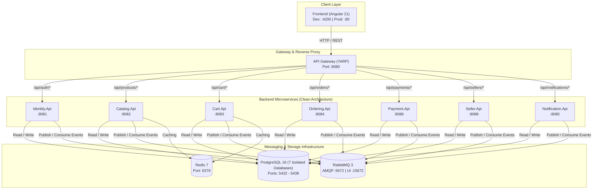

# AuraMart - Ứng dụng Web Thương mại Điện tử


[English](README.md) | [Tiếng Việt](README_VI.md)

Nền tảng thương mại điện tử full-stack được xây dựng theo **kiến trúc microservices** và các nguyên tắc **Clean Architecture**. AuraMart hỗ trợ sàn thương mại điện tử đa người bán (multi-vendor marketplace), quản lý danh mục sản phẩm, giỏ hàng, đơn hàng, thanh toán và quản lý nhà bán hàng.

## 🎯 Tổng quan Dự án

### Vấn đề Đặt ra & Mục tiêu
Xây dựng một nền tảng thương mại điện tử có khả năng mở rộng cao, sẵn sàng cho môi trường production bằng cách áp dụng kiến trúc microservices và các nguyên tắc Clean Code. Nền tảng hỗ trợ nhiều người bán, quản lý danh mục sản phẩm, giỏ hàng, đơn hàng, thanh toán và quản lý nhà bán hàng.

### Tính năng Chính
- ✅ Sàn thương mại điện tử đa người bán (Multi-vendor marketplace)
- ✅ Danh mục sản phẩm kèm phân loại và đánh giá
- ✅ Quản lý giỏ hàng & đơn hàng
- ✅ Tích hợp quy trình xử lý thanh toán
- ✅ Quản lý người bán & theo dõi tồn kho
- ✅ Thông báo theo thời gian thực
- ✅ Xác thực & phân quyền dựa trên JWT
- ✅ Giao diện Angular Responsive kết hợp Bootstrap UI

## 🏗️ Ngăn xếp Công nghệ (Tech Stack)

| Tầng | Công nghệ |
|-------|-----------|
| **Frontend** | Angular 21, TypeScript, Bootstrap 5.3, Chart.js, @ngx-translate |
| **API Gateway** | YARP (Yet Another Reverse Proxy) - dựa trên .NET |
| **Microservices** | C# (.NET 8+), Clean Architecture |
| **Cơ sở dữ liệu** | PostgreSQL 16 (cơ sở dữ liệu riêng cho từng service) |
| **Caching & Messaging** | Redis 7, RabbitMQ 3 |
| **Containerization** | Docker & Docker Compose |

## 🔗 Kiến trúc Hệ thống

### Tổng quan Cấp cao
AuraMart tuân theo mô hình **kiến trúc microservices**:
- **Frontend (Angular)** giao tiếp thông qua **YARP API Gateway** tập trung
- Gateway định tuyến yêu cầu tới **7 dịch vụ microservices** độc lập
- Mỗi dịch vụ microservices có **cơ sở dữ liệu PostgreSQL** riêng (mô hình Database-per-Service)
- **Redis** để lưu cache và quản lý phiên làm việc (session)
- **RabbitMQ** để giao tiếp bất đồng bộ theo mô hình hướng sự kiện (event-driven)
- Tất cả các dịch vụ đều áp dụng **Clean Architecture** với thiết kế phân tầng rõ ràng

### Sơ đồ Kiến trúc



## 🚀 Các Microservices

Mỗi dịch vụ tuân theo **Clean Architecture** với các tầng:
- **Domain Layer** - Logic kinh doanh cốt lõi, thực thể, kho lưu trữ
- **Application Layer** - Trường hợp sử dụng, DTOs, logic kinh doanh
- **Infrastructure Layer** - Cơ sở dữ liệu, dịch vụ bên ngoài
- **Presentation Layer** - API Controllers, xử lý yêu cầu/phản hồi

### Tổng quan Dịch vụ

| Dịch vụ | Port | Trách nhiệm |
|---------|------|-----------------|
| **Identity** | 8081 | Xác thực, quản lý người dùng, sinh token JWT |
| **Catalog** | 8082 | Sản phẩm, danh mục, đánh giá, hàng tồn kho bán hàng |
| **Cart** | 8083 | Quản lý giỏ hàng, lưu trữ mục giỏ |
| **Ordering** | 8084 | Tạo đơn hàng, quản lý, lịch sử |
| **Payment** | 8086 | Xử lý thanh toán, giao dịch |
| **Seller** | 8088 | Đăng ký bán hàng, quản lý hồ sơ |
| **Notification** | 8085 | Thông báo email, SMS, sở thích |

## 📊 Lược đồ Cơ sở dữ liệu

### Chiến lược Cơ sở dữ liệu
- **Mô hình**: Cơ sở dữ liệu cho mỗi dịch vụ
- **DBMS**: PostgreSQL 16 Alpine
- **Kiểm soát phiên bản**: EF Core migrations cho mỗi dịch vụ

### Cơ sở dữ liệu theo Dịch vụ

| Dịch vụ | Cơ sở dữ liệu | Port |
|---------|----------|------|
| Identity | identity_db | 5433 |
| Catalog | catalog_db | 5434 |
| Ordering | ordering_db | 5435 |
| Payment | payment_db | 5436 |
| Seller | seller_db | 5437 |
| Cart | cart_db | 5432 |
| Notification | notification_db | 5438 |

## 🔧 Cơ sở hạ tầng & Giao tiếp

### Redis (Bộ đệm Caching)
- **Phiên bản**: Redis 7 Alpine
- **Mục đích**: Tầng lưu cache cho session, sản phẩm, giỏ hàng
- **Port**: 6379
- **Tính bền vững**: AOF (Append Only File)

### RabbitMQ (Message Broker)
- **Phiên bản**: RabbitMQ 3 Alpine kèm giao diện quản trị (Management UI)
- **Mục đích**: Giao tiếp bất đồng bộ giữa các microservices
- **Port**: 5672 (AMQP), 15672 (Management UI)
- **Được sử dụng bởi**: Catalog, Ordering, Payment, Seller, Notification
- **Sự kiện (Events)**: OrderCreated, PaymentProcessed, InventoryUpdated, v.v.

### Xác thực & Bảo mật
- **Phương pháp**: JWT (JSON Web Tokens)
- **Hết hạn Token**: 60 phút (có thể định cấu hình)
- **Refresh Token**: 7 ngày (có thể định cấu hình)
- **Khóa API Nội bộ**: Xác thực giữa các dịch vụ

## 📡 Các tuyến đường API Gateway

Tất cả các tuyến được chuyển qua gateway tại `http://localhost:8080`

| Dịch vụ | Đường dẫn Cơ bản | Port |
|---------|-----------|------|
| Identity | /api/identity | 8081 |
| Catalog | /api/catalog | 8082 |
| Cart | /api/cart | 8083 |
| Ordering | /api/ordering | 8084 |
| Notification | /api/notification | 8085 |
| Payment | /api/payment | 8086 |
| Seller | /api/seller | 8088 |

### Ví dụ Các Endpoint Thường gặp
```
POST   /api/identity/auth/login           - Đăng nhập người dùng
POST   /api/identity/auth/register        - Đăng ký người dùng
GET    /api/catalog/products              - Lấy tất cả sản phẩm
POST   /api/catalog/products              - Tạo sản phẩm
GET    /api/cart/items                    - Lấy mục giỏ hàng
POST   /api/cart/items                    - Thêm vào giỏ hàng
POST   /api/ordering/orders               - Tạo đơn hàng
GET    /api/ordering/orders/{id}          - Lấy chi tiết đơn hàng
POST   /api/payment/transactions          - Xử lý thanh toán
```

## 📁 Cấu trúc Dự án

```
E-Commerce-Web-Application/
├── SourceCode/
│   ├── web_banhang_fe/                    # Angular Frontend
│   │   ├── src/
│   │   ├── angular.json
│   │   ├── Dockerfile
│   │   ├── package.json
│   │   └── README.md
│   │
│   ├── web_banhang_be/                    # Backend Microservices
│   │   ├── Gateway/                       # YARP API Gateway
│   │   │   └── Dockerfile
│   │   ├── Services/
│   │   │   ├── Identity/
│   │   │   │   ├── src/
│   │   │   │   │   ├── Identity.Domain/
│   │   │   │   │   ├── Identity.Application/
│   │   │   │   │   ├── Identity.Infrastructure/
│   │   │   │   │   └── Identity.API/
│   │   │   │   └── Dockerfile
│   │   │   ├── Catalog/
│   │   │   ├── Cart/
│   │   │   ├── Ordering/
│   │   │   ├── Payment/
│   │   │   ├── Seller/
│   │   │   └── Notification/
│   │   ├── BuildingBlocks/                # Tiện ích Chia sẻ
│   │   ├── Shared/                        # Thư viện Chia sẻ
│   │   ├── WebBanHang.sln
│   │   └── .dockerignore
│   │
│   └── web_banhang/                       # Docker configuration
│       ├── docker-compose.yml
│       ├── docker-compose.prod.yml
│       ├── .env.example
│       └── README.md
│
└── Documents/                              # Tài liệu dự án
    ├── api/
    ├── requirements/
    └── screens/
```

## 🚀 Khởi động Nhanh

### Điều kiện Tiên quyết
- Docker & Docker Compose (được khuyến khích cho stack đầy đủ)
- .NET SDK 8.0+ (chỉ để phát triển backend)
- Node.js 18+ & npm 11.6.2+ (để phát triển frontend)
- PostgreSQL 16 (chỉ khi không sử dụng Docker)
- Git

### Thiết lập với Docker Compose (Được Khuyến khích)

```bash
# Clone repository
git clone https://github.com/WanPhuc/E-Commerce-Web-Application.git
cd E-Commerce-Web-Application/SourceCode/web_banhang

# Tạo file .env từ ví dụ
cp .env.example .env

# Khởi động tất cả các dịch vụ (Frontend, Gateway, 7 Microservices, Databases, Redis, RabbitMQ)
docker-compose up -d

# Xác minh các dịch vụ đang chạy
docker-compose ps
```

**Điểm truy cập:**
- 🌐 **Frontend**: http://localhost:4200
- 🔌 **API Gateway**: http://localhost:8080
- 🐰 **RabbitMQ Management**: http://localhost:15672 (guest/guest)
- 📊 **Redis**: localhost:6379

### Phát triển Frontend

```bash
cd SourceCode/web_banhang_fe

# Cài đặt các phụ thuộc
npm install

# Bắt đầu máy chủ phát triển
ng serve

# Ứng dụng có sẵn tại http://localhost:4200
```

### Phát triển Backend

```bash
cd SourceCode/web_banhang_be

# Xây dựng giải pháp
dotnet build

# Chạy dịch vụ cụ thể (ví dụ: Identity Service)
cd Services/Identity/src/Identity.API
dotnet run

# Dịch vụ sẽ khởi động trên port 8081
```

### Dừng Tất cả Dịch vụ

```bash
cd SourceCode/web_banhang
docker-compose down

# Để xóa cả volumes (dữ liệu cơ sở dữ liệu)
docker-compose down -v
```

## 🎓 Quyết định Thiết kế & Lý do Kiến trúc

### Tại sao Microservices?
- **Khả năng mở rộng**: Mỗi dịch vụ mở rộng độc lập dựa trên nhu cầu
- **Tính linh hoạt Công nghệ**: Các dịch vụ khác nhau có thể sử dụng các ngăn xếp công nghệ khác nhau
- **Độc lập Nhóm**: Các dịch vụ có thể được phát triển/triển khai bởi các nhóm khác nhau
- **Tác động Portfolio**: Thể hiện kiến thức kiến trúc cấp doanh nghiệp
- **Khả năng phục hồi Dịch vụ**: Lỗi của một dịch vụ không làm hỏng toàn bộ hệ thống

### Tại sao Clean Architecture?
- **Khả năng kiểm tra**: Logic kinh doanh độc lập với các khung công việc
- **Khả năng bảo trì**: Tách biệt rõ ràng của các mối quan tâm
- **Tính linh hoạt**: Dễ dàng thay thế các triển khai hoặc cơ sở dữ liệu
- **Chất lượng Mã**: Buộc thực hiện các phương pháp lập trình kỷ luật, chuyên nghiệp
- **Dài hạn**: Giảm đáng kể nợ kỹ thuật

### Tại sao Cơ sở dữ liệu cho mỗi Dịch vụ?
- **Độc lập Dịch vụ**: Các dịch vụ không chia sẻ các mô hình dữ liệu
- **Lựa chọn Công nghệ**: Mỗi dịch vụ có thể sử dụng loại cơ sở dữ liệu khác nhau nếu cần
- **Mở rộng quy mô**: Tài nguyên cơ sở dữ liệu được phân bổ theo nhu cầu của dịch vụ
- **Quyền riêng tư Dữ liệu**: Dữ liệu dịch vụ bị cô lập

### Tại sao YARP Gateway?
- **Hiệu suất**: Định tuyến .NET gốc, độ trễ thấp
- **Sự nhất quán**: Gateway và các dịch vụ sử dụng cùng một ngăn xếp công nghệ
- **Tính năng**: Xác thực JWT tích hợp, định tuyến, giới hạn tốc độ
- **Quản lý**: Xử lý yêu cầu/phản hồi tập trung

## 🛠️ Các Công nghệ Chính được Giải thích

### Angular 21
- Phiên bản Angular framework mới nhất
- Các thành phần độc lập (phương pháp hiện đại)
- Gõ mạnh với TypeScript
- Lập trình phản ứng với RxJS

### C# Microservices
- .NET 8+ để hiệu suất và tính năng
- Clean Architecture để chất lượng mã
- Entity Framework Core để ORM
- MediatR cho mô hình CQRS (tùy chọn)

### PostgreSQL
- Cơ sở dữ liệu quan hệ đáng tin cậy
- Tuân thủ ACID cho dữ liệu giao dịch
- Tuyệt vời cho mô hình microservices
- Hiệu suất xuất sắc quy mô

### Redis
- Bộ đệm trong bộ nhớ để hiệu suất
- Lưu trữ phiên
- Dữ liệu thời gian thực
- pub/sub để thông báo

### RabbitMQ
- Người môi giới thông báo cho giao tiếp không đồng bộ
- Ngăn chặn liên kết chặt chẽ giữa các dịch vụ
- Đảm bảo tính nhất quán cuối cùng
- Xử lý các lỗi hệ thống một cách duyên dáng

## 🔐 Bảo mật

- **Xác thực**: Mã thông báo JWT với thời gian hết hạn có thể định cấu hình
- **Ủy quyền**: Kiểm soát truy cập dựa trên vai trò (RBAC)
- **API Gateway**: Điểm xác thực trung tâm
- **Service-to-Service**: Xác thực khóa API nội bộ
- **HTTPS**: Hỗ trợ trong sản xuất (cấu hình trong docker-compose.prod.yml)
- **Biến môi trường**: Dữ liệu nhạy cảm trong tệp .env (không có trong repo)

## 📈 Các cải tiến trong Tương lai & Lộ trình

### Các Cải tiến được Lên kế hoạch
- [ ] Mô-đun ML dựa trên Python để giới thiệu sản phẩm
- [ ] Sắp xếp Kubernetes (K8s) cho triển khai sản xuất
- [ ] Tầng API GraphQL như một giải pháp thay thế cho REST
- [ ] Cập nhật theo thời gian thực bằng WebSockets/SignalR
- [ ] Kiểm tra đơn vị & tích hợp toàn diện (xUnit)
- [ ] Đường dẫn CI/CD (GitHub Actions hoặc GitLab CI)
- [ ] APM & Giám sát (Application Insights / Prometheus)
- [ ] Tối ưu hóa hiệu suất frontend bằng lazy loading
- [ ] Bảng điều khiển quản trị để giám sát hệ thống
- [ ] Tích hợp Elasticsearch để tìm kiếm sản phẩm nâng cao
- [ ] Tích hợp CDN cho tài sản tĩnh
- [ ] Cải thiện hỗ trợ đa ngôn ngữ

## 💡 Bài học đã Học được

- **Sự cân bằng Microservices**: Khả năng mở rộng đi kèm với sự phức tạp hoạt động
- **Giá trị Clean Architecture**: Tiết kiệm nỗ lực tái cấu trúc đáng kể
- **Thành thạo Docker**: Rất cần thiết để phát triển hiện đại
- **Giao tiếp không đồng bộ**: RabbitMQ ngăn chặn liên kết chặt chẽ
- **Cấu hình Môi trường**: .env làm cho chuyển đổi dev/prod dễ dàng

## 🔒 Bảo vệ Nhánh (Branch Protection)

Kho lưu trữ này áp dụng quy tắc bảo vệ nhánh đối với `main`:
- ✅ Yêu cầu tạo Pull Request (PR) trước khi merge
- ✅ Yêu cầu review code (tự review đối với cá nhân phát triển độc lập)
- ✅ Hủy các lượt phê duyệt PR cũ khi có commit mới
- ✅ Bắt buộc nhánh phải cập nhật mới nhất trước khi merge

**Quy trình**: Feature Branch → Commit → Pull Request → Code Review → Merge

## 📚 Tài liệu Dự án

- [Frontend README](./SourceCode/web_banhang_fe/README.md) - Hướng dẫn thiết lập & phát triển Angular
- [Docker Compose Setup](./SourceCode/web_banhang/README.md) - Hướng dẫn triển khai môi trường
- [API Documentation](./Documents/api/) - Chi tiết các endpoint API

## 🤝 Đóng góp (Contributing)

Là một dự án độc lập, toàn bộ quy trình phát triển tuân theo:
1. Tạo nhánh tính năng mới từ `main`
2. Commit code với thông điệp rõ ràng (theo chuẩn Conventional Commits)
3. Tạo Pull Request
4. Tự review mã nguồn
5. Merge vào nhánh `main`

## 📝 Ví dụ Quy trình Phát triển

```bash
# Bắt đầu phát triển tính năng mới
git checkout -b feature/add-product-filter
git add .
git commit -m "feat: add product filter functionality"
git push origin feature/add-product-filter

# Tạo PR trên GitHub
# Tự review code và merge
# Xóa nhánh tính năng sau khi hoàn tất
git checkout main
git pull origin main
git branch -d feature/add-product-filter
```

## 🐛 Các Vấn đề & Thách thức Đã giải quyết

| Thách thức | Trạng thái | Giải pháp |
|-----------|--------|----------|
| Giao tiếp Service-to-Service | ✅ Đã giải quyết | RabbitMQ async (event-driven) + HTTP sync |
| Giao dịch phân tán (Distributed Transactions) | ✅ Đã giải quyết | Saga pattern thông qua RabbitMQ |
| Tính nhất quán dữ liệu (Data Consistency) | ✅ Đã giải quyết | Event Sourcing + Eventual Consistency |
| Độ phức tạp khi triển khai | ✅ Đã giải quyết | Đóng gói toàn bộ với Docker & Docker Compose |
| Kết nối Frontend tới nhiều API | ✅ Đã giải quyết | Điểm truy cập tập trung duy nhất qua YARP Gateway |

## 📊 Thống kê Dự án

- **Dịch vụ**: 7 microservices backend độc lập
- **Cơ sở dữ liệu**: 7 database PostgreSQL riêng biệt (cô lập hoàn toàn)
- **Tech Stack**: Angular 21 + .NET 8 (C#) + PostgreSQL + Redis + RabbitMQ
- **Kiến trúc**: Microservices + Clean Architecture
- **Containerization**: Hỗ trợ toàn diện Docker & Docker Compose
- **Quy mô code**: 10,000+ dòng code (ước tính)

## 🎯 Giá trị Kỹ thuật & Ứng dụng Thực tế

Dự án này thể hiện năng lực:
- **Kiến trúc Doanh nghiệp (Enterprise Architecture)**: Xây dựng hệ thống microservices quy mô
- **Mã sạch (Clean Code & Clean Architecture)**: Tiêu chuẩn thiết kế code chuyên nghiệp
- **Thành thạo Docker**: Đóng gói và điều phối container nhất quán giữa dev và prod
- **Thiết kế Cơ sở dữ liệu**: Quản lý nhiều cơ sở dữ liệu độc lập theo mô hình Database-per-Service
- **Thiết kế API**: Mô hình API Gateway định tuyến chuẩn RESTful
- **Frontend Hiện đại**: Angular mới nhất với component độc lập (standalone components)
- **Backend Best Practices**: Thực hành chuẩn kiến trúc sạch trên nền tảng .NET

## 📄 Giấy phép (License)

Dự án này được cấp phép theo Giấy phép GNU General Public License v3.0 (GPL-3.0) - xem tệp [LICENSE](LICENSE) để biết chi tiết.

## ✉️ Liên hệ

- **Tác giả**: Wan Phuc
- **Kho lưu trữ**: https://github.com/WanPhuc/E-Commerce-Web-Application
- **Báo lỗi & Góp ý**: Sử dụng GitHub Issues để báo cáo lỗi

---

**Cập nhật lần cuối**: Tháng 9 năm 2026  
**Trạng thái**: Đang tích cực phát triển (Active Development)  
**Kiến trúc**: Microservices + Clean Architecture ✨

*Được xây dựng với ❤️ như một dự án portfolio chuyên nghiệp thể hiện năng lực phát triển full-stack cấp doanh nghiệp.*
